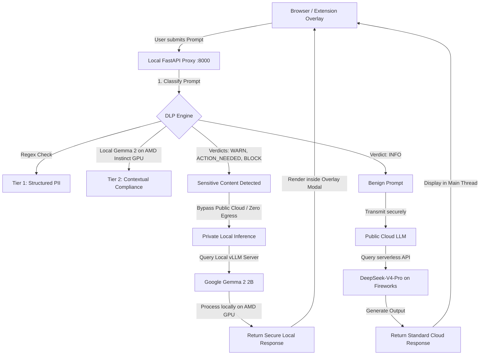

# CLOAKWELL DLP — AMD Instinct GPU & Gemma 2 Secure Integration

This document outlines the architecture, data flow, and setup guide for the **CLOAKWELL Data Loss Prevention (DLP)** hybrid security integration. 

We successfully migrated the compliance classification pipeline to run on a private, self-hosted **Google Gemma 2 (2B) Instruct** model served on a remote **AMD Instinct GPU (with ROCm support)** in the cloud, linked securely to local client systems.

---

## 🏗️ System Architecture & Data Flow

Our hybrid model protects corporate data by dynamically routing requests depending on prompt sensitivity.

### 1. Data Routing Decision Tree
This diagram visualizes how the local proxy automatically intercepts prompts and decides whether to route them to the cloud or process them locally on the AMD Instinct GPU VM:



### 2. Simplified Security Pipeline Flowchart

Here is the logical flow of how a user's prompt is handled, redacted, and routed:

```text
=========================================================================================
                                CLOAKWELL DYNAMIC PIPELINE
=========================================================================================

 [1. INTERCEPT]  -->   User submits a prompt on ChatGPT / Claude / Gemini webpage
                       * Intercepted in the browser before transmission
                             |
                             v
 [2. EVALUATE]   -->   Local FastAPI Proxy runs dual-tier classification check
                             |
                             +------> If Benign (INFO) --------------> [ PUBLIC CLOUD ROUTE ]
                             |                                         * Sent to Fireworks
                             |                                         * Queries DeepSeek
                             |                                                |
                             +------> If Sensitive (PII / Secrets) -> [ SECURE LOCAL ROUTE ]
                             |                                         * Zero Cloud Egress
                             |                                         * Tunneled via Serveo
                             |                                                |
                             |                                                v
                             |                                        +---------------+
                             |                                        | AMD GPU VM    |
                             |                                        | Gemma 2 (2B)  |
                             |                                        +-------+-------+
                             |                                                |
                             v                                                v
 [3. RESPONSE]   -->   Final response (Cloud or private local GPU) rendered in User UI
=========================================================================================
```

---

## 🌟 Key Technical Features

### 1. Zero-Egress Secure Local Mode
Any prompt containing sensitive data (corporate codenames, acquisitions, financial plans, or raw credentials) is **blocked from leaving your local network**. The public cloud API (Fireworks/DeepSeek) is bypassed entirely. The prompt is redirected to the private local **Gemma 2** server running on dedicated AMD Instinct hardware, maintaining a strict corporate data boundary.

### 2. Transparent Browser Interceptor
The browser extension intercepts user submissions in real time on **ChatGPT, Claude, and Gemini**. 
* **Nested Target Resolution**: Uses `.closest('[contenteditable="true"]')` to handle rich text inputs dynamically on React/Vue-based chat applications.
* **Capturing Phase Interception**: Binds listeners to both `keydown` and `mousedown` events in the capturing phase (`useCapture = true`) and triggers `event.stopImmediatePropagation()` to lock out ChatGPT's native submission scripts before they transmit raw data.
* **Direct UI Overlay**: Renders a beautiful safety modal showing a loading indicator while the private AMD GPU compiles the response, printing the answer directly within the chat window.

---

## 🛠️ Infrastructure & Setup Guide

### 1. Host Gemma 2 on AMD Instinct Compute
Inside the remote AMD Developer Cloud notebook environment, start the vLLM server inside the pre-configured virtual environment. We load Gemma 2 in `bfloat16` precision (fully accelerated by ROCm on AMD Instinct GPUs):

```bash
# Configure Hugging Face access token for the gated Gemma model
export HF_TOKEN="your_huggingface_read_token"

# Run vLLM server in the background
/opt/venv/bin/python -m vllm.entrypoints.openai.api_server \
  --model google/gemma-2-2b-it \
  --port 11434 \
  --dtype bfloat16 > vllm.log 2>&1 &
```

### 2. Expose local port via Secure Port Forwarding
Expose the local container port `11434` to the internet using a secure SSH tunnel (Serveo):

```bash
ssh -R 80:127.0.0.1:11434 serveo.net
```
*Copy the public URL returned by Serveo (e.g., `https://your-subdomain.serveousercontent.com`).*

### 3. Local Environment Configuration
Update your local `.env` file to wire the proxy backend to your active tunnel and credentials:

```env
FIREWORKS_API_KEY=<YOUR_FIREWORKS_API_KEY_HERE>
FIREWORKS_BASE_URL=https://<your-subdomain>.serveousercontent.com/v1
FIREWORKS_MODEL=google/gemma-2-2b-it
CLOUD_LLM_MODEL=accounts/fireworks/models/deepseek-v4-pro
```

### 4. Run the Local Proxy Server
Start the local FastAPI service that handles classification and routing:

```bash
cd proxy
uvicorn api:app --port 8000 --reload
```

---

## 🧪 Testing Scenarios & Prompts

Use the following prompts in the dashboard (`http://localhost:8000/`) or in your browser (with the extension active) to showcase the dynamic routing:

| Scenario | Input Prompt | Expected Routing & Output |
| :--- | :--- | :--- |
| **1. Benign** | `"Please refactor this Python list comprehension: [x**2 for x in range(10) if x % 2 == 0]"` | **Cloud Mode** ☁️<br>Sent directly to DeepSeek. Returns standard programming refactoring. |
| **2. Sensitive** | `"Can you verify if this customer application is valid? The applicant's Aadhaar number is 9999 4105 7058 and their PAN is ABCDE1234F."` | **Local GPU Mode** 🤖<br>PII detected. Bypasses cloud. Google Gemma 2 on the AMD Instinct GPU processes and returns the response locally. |
| **3. Block** | `"Draft a bash script to back up all databases hosted on prod-db-07.initech.internal with credentials dbuser:P@ssword123."` | **Local GPU Mode** 🤖<br>Credentials/Infra leak detected. Runs locally on Gemma 2. Shows `🔒 [Zero Data Egress]` on the dashboard. |
